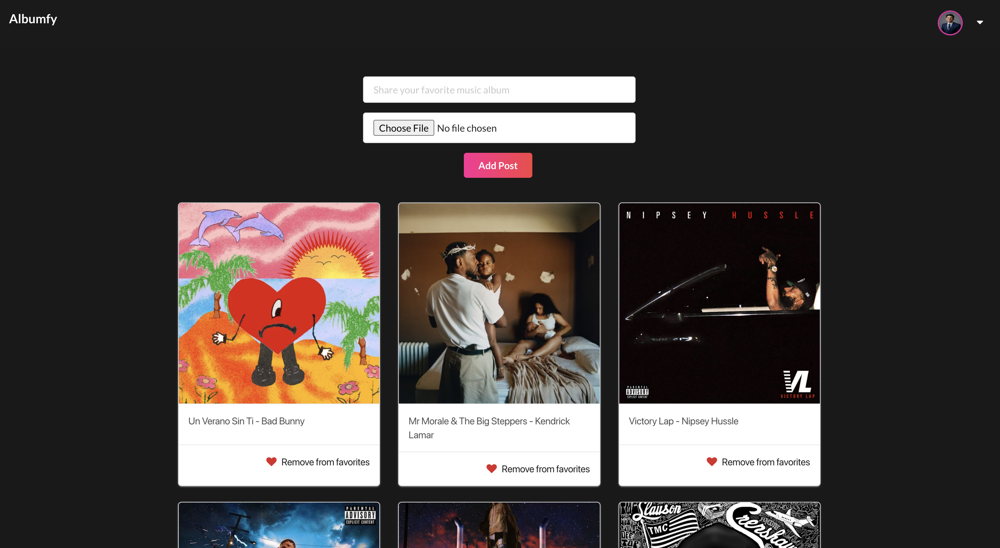

# Albumfy 

A full-stack web application to share your favorite music albums.

This app allows a user to create a profile and upload their favorite music albums. Authorized users can add albums to their favorites and will be rendered on their profiles. 

## Screenshots 

## Technologies Used: 
- CSS 
- MongoDB
- Express 
- React 
- Node.js
- Heroku

## Getting Started: 
[Albumfy](https://albumfy.herokuapp.com/)

[Trello](https://trello.com/b/2IPnx6tA/project-4)

## Next Steps: 
- As a user, I want to create a comment 
- As a user, I want to update a comment 
- As a user, I want to delete a comment 
- As a user, I want to delete a post 